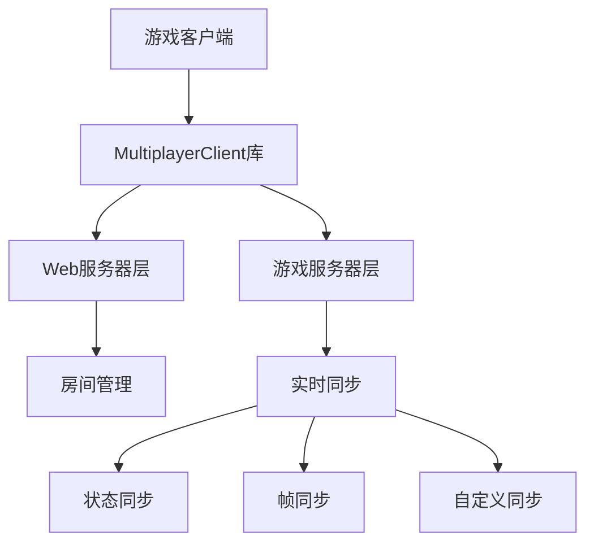

# 联机游戏开发者文档

## 📋 目录

- [概述](#概述)
- [快速开始](#快速开始)
- [API 参考](#api-参考)
- [同步模式指南](#同步模式指南)
- [最佳实践](#最佳实践)
- [调试和测试](#调试和测试)
- [常见问题](#常见问题)
- [示例代码](#示例代码)

## 概述

本联机游戏系统为开发者提供了完整的多人游戏解决方案，支持：

- **双层架构**：Web服务器层（房间管理）+ 游戏服务器层（实时同步）
- **两种模式**：P2P模式（高性能）+ 服务器中继模式（稳定可靠）
- **三种同步**：状态同步、帧同步、用户自定义
- **简化API**：封装复杂的网络通信，提供简单易用的接口

### 系统架构



## 快速开始

### 1. 环境准备

创建游戏目录：
```bash
mkdir templates/multiplayer_games/my_game
cd templates/multiplayer_games/my_game
```

### 2. 基础HTML结构

```html
<!DOCTYPE html>
<html lang="zh-CN">
<head>
    <meta charset="UTF-8">
    <meta name="viewport" content="width=device-width, initial-scale=1.0">
    <title>我的多人游戏</title>
</head>
<body>
    <div id="gameContainer">
        <!-- 游戏界面 -->
    </div>

    <!-- 必需的库文件 -->
    <script src="/static/libs/socket.io.min.js"></script>
    <script src="/static/libs/multiplayer.js"></script>
    
    <script>
        // 游戏逻辑
    </script>
</body>
</html>
```

### 3. 初始化客户端

```javascript
// 创建多人游戏客户端
const client = new MultiplayerClient();

// 设置事件回调
client.on('onStateSync', handleStateSync);
client.on('onFrameSync', handleFrameSync);
client.on('onPlayerLeft', handlePlayerLeft);
client.on('onRoomClosed', handleRoomClosed);
client.on('onError', handleError);

// 游戏状态
let gameState = {
    players: {},
    gameData: {}
};
```

### 4. 房间管理流程

```javascript
// 创建房间
async function createRoom() {
    try {
        const result = await client.createRoom('我的游戏房间');
        if (result.success) {
            // 初始化游戏设置
            await client.updateGameInfo({
                gameMode: '服务器中继',
                syncType: '状态同步',
                players: [result.host_ip],
                customInfo: {
                    maxPlayers: 4,
                    gameType: 'strategy'
                }
            });
            startGame(true); // 作为房主开始游戏
        }
    } catch (error) {
        console.error('创建房间失败:', error);
    }
}

// 加入房间
async function joinRoom(roomId) {
    try {
        const result = await client.joinRoom(roomId);
        if (result.success && result.mode === '服务器中继') {
            startGame(false); // 作为成员开始游戏
        }
    } catch (error) {
        console.error('加入房间失败:', error);
    }
}
```

## API 参考

### MultiplayerClient 类

#### 构造函数
```javascript
const client = new MultiplayerClient();
```

#### 方法

##### createRoom(roomName)
创建新房间
- **参数**: `roomName` (string) - 房间名称
- **返回**: Promise<Object> - 创建结果
- **权限**: 任何用户

```javascript
const result = await client.createRoom('房间名称');
// result: { success: boolean, room_id: string, room_name: string, host_ip: string }
```

##### getRooms()
获取可用房间列表
- **返回**: Promise<Array> - 房间列表
- **权限**: 任何用户

```javascript
const rooms = await client.getRooms();
// rooms: [{ room_id, room_name, host_ip, current_players, max_players, created_at }]
```

##### joinRoom(roomId)
加入指定房间
- **参数**: `roomId` (string) - 房间ID
- **返回**: Promise<Object> - 加入结果
- **权限**: 任何用户

```javascript
const result = await client.joinRoom('1703123456789123456');
// result: { success: boolean, mode: string, ... }
```

##### updateGameInfo(config)
更新游戏配置
- **参数**: `config` (Object) - 游戏配置
- **返回**: Promise<Object> - 更新结果
- **权限**: 仅房主

```javascript
await client.updateGameInfo({
    gameMode: '服务器中继',        // 'p2p' | '服务器中继'
    syncType: '状态同步',          // '状态同步' | '帧同步' | '用户自定义'
    players: ['192.168.1.100'],   // 玩家IP列表
    customInfo: {}                // 自定义配置
});
```

##### sendData(data)
发送游戏数据
- **参数**: `data` (any) - 要发送的数据
- **返回**: Promise<Object> - 发送结果
- **权限**: 房间内玩家

```javascript
await client.sendData({
    type: 'player_action',
    action: 'move',
    x: 100,
    y: 200
});
```

##### exitRoom()
退出当前房间
- **返回**: Promise<Object> - 退出结果
- **权限**: 房间内玩家

```javascript
await client.exitRoom();
```

#### 事件回调

##### on(event, callback)
设置事件回调函数
- **参数**: 
  - `event` (string) - 事件名称
  - `callback` (function) - 回调函数

**支持的事件**:

| 事件名 | 描述 | 回调参数 |
|--------|------|----------|
| `onStateSync` | 状态同步 | `(data)` |
| `onFrameSync` | 帧同步 | `(data)` |
| `onCustomSync` | 自定义同步 | `(data)` |
| `onPlayerLeft` | 玩家离开 | `(data)` |
| `onRoomClosed` | 房间关闭 | `(data)` |
| `onError` | 错误发生 | `(error)` |

## 同步模式指南

### 状态同步

**适用场景**: 回合制游戏、卡牌游戏、策略游戏

**特点**:
- 发送完整游戏状态
- 服务器保存最新状态（≤10MB）
- 新玩家自动同步最新状态
- 适合状态变化不频繁的游戏

**实现模式**:

```javascript
// 1. 初始化为状态同步
await client.updateGameInfo({
    gameMode: '服务器中继',
    syncType: '状态同步',
    players: playerList,
    customInfo: gameConfig
});

// 2. 发送状态更新
async function updateGameState(newState) {
    gameState = newState;
    await client.sendData({
        type: 'game_state_update',
        state: gameState,
        timestamp: Date.now()
    });
}

// 3. 接收状态同步
function handleStateSync(data) {
    if (data.type === 'initial_state') {
        // 新玩家加入时的初始状态
        gameState = data.data.state;
        renderGame();
    } else if (data.data.type === 'game_state_update') {
        // 状态更新
        gameState = data.data.state;
        renderGame();
    }
}
```

**最佳实践**:
```javascript
// 只在关键状态变化时同步
function onPlayerMove(playerId, newPosition) {
    gameState.players[playerId].position = newPosition;
    
    // 立即更新本地显示
    renderPlayer(playerId, newPosition);
    
    // 同步给其他玩家
    updateGameState(gameState);
}

// 状态压缩
function compressGameState(state) {
    return {
        p: state.players,  // 简化字段名
        s: state.score,
        t: state.turn
    };
}
```

### 帧同步

**适用场景**: 实时对战游戏、动作游戏、竞技游戏

**特点**:
- 16 tick/秒 (62.5ms间隔)
- 操作队列管理 (≤10个操作)
- 确保所有客户端逻辑一致
- 适合需要精确同步的游戏

**实现模式**:

```javascript
// 1. 初始化为帧同步
await client.updateGameInfo({
    gameMode: '服务器中继',
    syncType: '帧同步',
    players: playerList,
    customInfo: gameConfig
});

// 2. 发送操作指令
async function sendPlayerAction(action) {
    await client.sendData({
        type: 'player_operation',
        action: action,
        timestamp: Date.now()
    });
}

// 3. 接收帧同步
function handleFrameSync(data) {
    const { tick, players, timestamp } = data;
    
    // 执行所有玩家的操作
    for (const [playerIP, operations] of Object.entries(players)) {
        operations.forEach(op => {
            executeOperation(playerIP, op.data);
        });
    }
    
    // 更新游戏逻辑
    updateGameLogic(tick);
    renderGame();
}

// 4. 游戏逻辑更新
function updateGameLogic(tick) {
    // 所有客户端必须执行相同的逻辑
    updatePhysics();
    checkCollisions();
    updateUI();
}
```

**最佳实践**:
```javascript
// 输入缓冲
let inputBuffer = [];

function handleInput(input) {
    inputBuffer.push({
        type: input.type,
        data: input.data,
        frame: currentFrame
    });
}

// 定期发送操作
setInterval(() => {
    if (inputBuffer.length > 0) {
        sendPlayerAction({
            operations: inputBuffer.splice(0)
        });
    }
}, 50); // 稍快于帧同步频率

// 预测和回滚
function executeOperation(playerIP, operation) {
    if (playerIP === myIP) {
        // 本地操作，可能需要回滚
        rollbackAndReplay(operation);
    } else {
        // 远程操作，直接执行
        applyOperation(operation);
    }
}
```

### 用户自定义同步

**适用场景**: 特殊需求游戏、混合同步模式

**特点**:
- 完全自定义同步逻辑
- 服务器仅做消息转发
- 最大灵活性

**实现模式**:
```javascript
// 1. 初始化为自定义同步
await client.updateGameInfo({
    gameMode: '服务器中继',
    syncType: '用户自定义',
    players: playerList,
    customInfo: gameConfig
});

// 2. 自定义消息处理
function handleCustomSync(data) {
    const { type, from, data: messageData } = data;
    
    switch (messageData.messageType) {
        case 'position_update':
            handlePositionUpdate(from, messageData);
            break;
        case 'game_event':
            handleGameEvent(from, messageData);
            break;
        case 'chat_message':
            handleChatMessage(from, messageData);
            break;
    }
}

// 3. 发送自定义消息
async function sendCustomMessage(messageType, data) {
    await client.sendData({
        messageType: messageType,
        data: data,
        timestamp: Date.now()
    });
}
```

## 最佳实践

### 1. 错误处理

```javascript
// 全局错误处理
client.on('onError', (error) => {
    console.error('多人游戏错误:', error);
    
    // 显示用户友好的错误信息
    showErrorMessage('连接出现问题，请重试');
    
    // 自动重连逻辑
    if (error.code === 'CONNECTION_LOST') {
        setTimeout(reconnect, 3000);
    }
});

// API 调用错误处理
async function safeApiCall(apiFunction, errorMessage) {
    try {
        return await apiFunction();
    } catch (error) {
        console.error(errorMessage, error);
        showErrorMessage(errorMessage);
        return null;
    }
}
```

### 2. 网络优化

```javascript
// 数据压缩
function compressData(data) {
    // 移除不必要的字段
    const compressed = {
        t: data.type,
        d: data.data,
        ts: data.timestamp
    };
    return compressed;
}

// 批量发送
let dataBuffer = [];
function batchSendData(data) {
    dataBuffer.push(data);
    
    if (dataBuffer.length >= 5) {
        flushDataBuffer();
    }
}

function flushDataBuffer() {
    if (dataBuffer.length > 0) {
        client.sendData({
            type: 'batch_data',
            items: dataBuffer.splice(0)
        });
    }
}

// 定期刷新缓冲区
setInterval(flushDataBuffer, 100);
```

### 3. 状态管理

```javascript
// 状态版本控制
let stateVersion = 0;

function updateGameState(newState) {
    stateVersion++;
    gameState = {
        ...newState,
        version: stateVersion,
        timestamp: Date.now()
    };
    
    // 只同步变化的部分
    const delta = calculateStateDelta(previousState, gameState);
    sendStateDelta(delta);
}

// 状态回滚
function rollbackToState(targetVersion) {
    const targetState = stateHistory.find(s => s.version === targetVersion);
    if (targetState) {
        gameState = { ...targetState };
        renderGame();
    }
}
```

### 4. 性能优化

```javascript
// 渲染优化
let renderScheduled = false;

function scheduleRender() {
    if (!renderScheduled) {
        renderScheduled = true;
        requestAnimationFrame(() => {
            renderGame();
            renderScheduled = false;
        });
    }
}

// 数据去重
const messageCache = new Set();

function handleMessage(data) {
    const messageId = data.id || JSON.stringify(data);
    if (messageCache.has(messageId)) {
        return; // 重复消息，忽略
    }
    
    messageCache.add(messageId);
    
    // 清理旧缓存
    if (messageCache.size > 1000) {
        messageCache.clear();
    }
    
    processMessage(data);
}
```

## 调试和测试

### 调试工具

```javascript
// 开启调试模式
const DEBUG = true;

function debugLog(message, data = null) {
    if (DEBUG) {
        console.log(`[多人游戏] ${message}`, data);
    }
}

// 网络状态监控
let networkStats = {
    messagesSent: 0,
    messagesReceived: 0,
    bytesSent: 0,
    bytesReceived: 0
};

// 重写 sendData 添加统计
const originalSendData = client.sendData;
client.sendData = async function(data) {
    networkStats.messagesSent++;
    networkStats.bytesSent += JSON.stringify(data).length;
    debugLog('发送数据', { data, stats: networkStats });
    return originalSendData.call(this, data);
};

// 显示调试信息
function showDebugInfo() {
    const debugDiv = document.getElementById('debug-info');
    if (debugDiv) {
        debugDiv.innerHTML = `
            <h4>网络统计</h4>
            <p>发送: ${networkStats.messagesSent} 消息, ${networkStats.bytesSent} 字节</p>
            <p>接收: ${networkStats.messagesReceived} 消息, ${networkStats.bytesReceived} 字节</p>
            <p>房间ID: ${client.roomId}</p>
            <p>同步类型: ${client.syncType}</p>
        `;
    }
}
```

### 本地测试

```javascript
// 模拟网络延迟
function simulateNetworkDelay(callback, delay = 100) {
    setTimeout(callback, delay + Math.random() * 50);
}

// 模拟网络丢包
function simulatePacketLoss(callback, lossRate = 0.1) {
    if (Math.random() > lossRate) {
        callback();
    } else {
        console.warn('模拟丢包');
    }
}

// 多客户端测试
function openTestWindows() {
    const baseUrl = window.location.href;
    
    // 打开房主窗口
    window.open(baseUrl + '?role=host', 'host', 'width=800,height=600');
    
    // 打开多个客户端窗口
    for (let i = 1; i <= 3; i++) {
        setTimeout(() => {
            window.open(baseUrl + `?role=client&id=${i}`, `client${i}`, 'width=800,height=600');
        }, i * 1000);
    }
}
```

## 常见问题

### Q: 房间创建后其他玩家无法加入？

**A**: 检查以下几点：
1. 房主是否已调用 `updateGameInfo()` 初始化游戏？
2. 房间是否已满（默认20人）？
3. 网络连接是否正常？

```javascript
// 确保房间初始化
async function createAndInitRoom(roomName) {
    const result = await client.createRoom(roomName);
    if (result.success) {
        // 必须调用这个来初始化游戏服务器
        await client.updateGameInfo({
            gameMode: '服务器中继',
            syncType: '状态同步',
            players: [result.host_ip]
        });
    }
}
```

### Q: 状态同步时数据丢失？

**A**: 状态同步会覆盖之前的状态，确保发送完整状态：

```javascript
// 错误：只发送变化部分
await client.sendData({ playerId: 'player1', x: 100 });

// 正确：发送完整状态
await client.sendData({
    type: 'complete_state',
    players: gameState.players,
    gameData: gameState.gameData,
    timestamp: Date.now()
});
```

### Q: 帧同步时出现不同步现象？

**A**: 确保所有客户端使用相同的游戏逻辑：

```javascript
// 确保确定性的游戏逻辑
function updateGameLogic(tick) {
    // 使用固定的随机种子
    Math.seedrandom(tick);
    
    // 确保浮点数运算一致
    position.x = Math.round(position.x * 100) / 100;
    
    // 按固定顺序处理玩家
    const sortedPlayers = Object.keys(players).sort();
    sortedPlayers.forEach(playerId => {
        updatePlayer(players[playerId]);
    });
}
```

### Q: WebSocket 连接频繁断开？

**A**: 添加连接状态监控和重连机制：

```javascript
let reconnectAttempts = 0;
const maxReconnectAttempts = 5;

client.on('onError', (error) => {
    if (error.type === 'CONNECTION_LOST' && reconnectAttempts < maxReconnectAttempts) {
        reconnectAttempts++;
        console.log(`尝试重连 (${reconnectAttempts}/${maxReconnectAttempts})`);
        
        setTimeout(() => {
            // 重新加入房间
            client.joinRoom(client.roomId);
        }, 2000 * reconnectAttempts);
    }
});
```

## 示例代码

### 简单回合制游戏

```javascript
class TurnBasedGame {
    constructor() {
        this.client = new MultiplayerClient();
        this.gameState = {
            currentPlayer: 0,
            players: [],
            board: [],
            turn: 0
        };
        
        this.setupEventHandlers();
    }
    
    setupEventHandlers() {
        this.client.on('onStateSync', (data) => {
            if (data.type === 'initial_state') {
                this.gameState = data.data.gameState;
            } else if (data.data.type === 'game_update') {
                this.gameState = data.data.gameState;
            }
            this.render();
        });
    }
    
    async makeMove(move) {
        // 验证移动是否合法
        if (!this.isValidMove(move)) {
            return;
        }
        
        // 更新本地状态
        this.applyMove(move);
        
        // 同步给其他玩家
        await this.client.sendData({
            type: 'game_update',
            gameState: this.gameState,
            move: move
        });
        
        this.render();
    }
    
    isValidMove(move) {
        // 检查是否轮到当前玩家
        return this.gameState.currentPlayer === this.getMyPlayerIndex();
    }
    
    applyMove(move) {
        // 应用移动到游戏状态
        this.gameState.board[move.x][move.y] = this.gameState.currentPlayer;
        this.gameState.currentPlayer = (this.gameState.currentPlayer + 1) % this.gameState.players.length;
        this.gameState.turn++;
    }
    
    render() {
        // 渲染游戏界面
        const boardEl = document.getElementById('board');
        boardEl.innerHTML = this.renderBoard();
        
        const statusEl = document.getElementById('status');
        statusEl.textContent = `回合 ${this.gameState.turn} - 当前玩家: ${this.gameState.currentPlayer}`;
    }
}
```

### 实时动作游戏

```javascript
class RealtimeGame {
    constructor() {
        this.client = new MultiplayerClient();
        this.players = new Map();
        this.myPlayerId = null;
        this.inputBuffer = [];
        
        this.setupEventHandlers();
        this.startGameLoop();
    }
    
    setupEventHandlers() {
        this.client.on('onFrameSync', (data) => {
            const { tick, players } = data;
            
            // 执行所有玩家的操作
            for (const [playerIP, operations] of Object.entries(players)) {
                operations.forEach(op => {
                    this.executeOperation(playerIP, op.data);
                });
            }
            
            this.updateGameLogic(tick);
        });
        
        // 监听输入
        document.addEventListener('keydown', (e) => {
            this.handleInput(e.key);
        });
    }
    
    handleInput(key) {
        const action = this.mapKeyToAction(key);
        if (action) {
            this.inputBuffer.push(action);
        }
    }
    
    mapKeyToAction(key) {
        const keyMap = {
            'w': { type: 'move', direction: 'up' },
            's': { type: 'move', direction: 'down' },
            'a': { type: 'move', direction: 'left' },
            'd': { type: 'move', direction: 'right' },
            ' ': { type: 'action', action: 'shoot' }
        };
        return keyMap[key];
    }
    
    startGameLoop() {
        setInterval(() => {
            // 发送输入操作
            if (this.inputBuffer.length > 0) {
                this.client.sendData({
                    type: 'player_operations',
                    operations: this.inputBuffer.splice(0)
                });
            }
            
            // 本地渲染
            this.render();
        }, 16); // 60 FPS
    }
    
    executeOperation(playerIP, operation) {
        const player = this.players.get(playerIP);
        if (!player) return;
        
        switch (operation.type) {
            case 'move':
                this.movePlayer(player, operation.direction);
                break;
            case 'action':
                this.executePlayerAction(player, operation.action);
                break;
        }
    }
    
    updateGameLogic(tick) {
        // 更新游戏物理
        this.updatePhysics();
        
        // 检查碰撞
        this.checkCollisions();
        
        // 更新游戏对象
        this.updateGameObjects();
    }
    
    render() {
        const canvas = document.getElementById('gameCanvas');
        const ctx = canvas.getContext('2d');
        
        // 清空画布
        ctx.clearRect(0, 0, canvas.width, canvas.height);
        
        // 渲染所有玩家
        this.players.forEach(player => {
            this.renderPlayer(ctx, player);
        });
        
        // 渲染游戏对象
        this.renderGameObjects(ctx);
    }
}
```

---

## 相关文档

- [系统架构文档](./multiplayer_game.md)
- [使用说明](./multiplayer_usage.md)
- [示例游戏源码](./templates/multiplayer_games/chat_room/)

## 版本信息

**当前版本**: v2.0.0  
**最后更新**: 2024-01-09  
**维护者**: 游戏平台开发团队

---

💡 **提示**: 开发过程中遇到问题，请优先查看[常见问题](#常见问题)部分，或参考示例代码进行调试。 